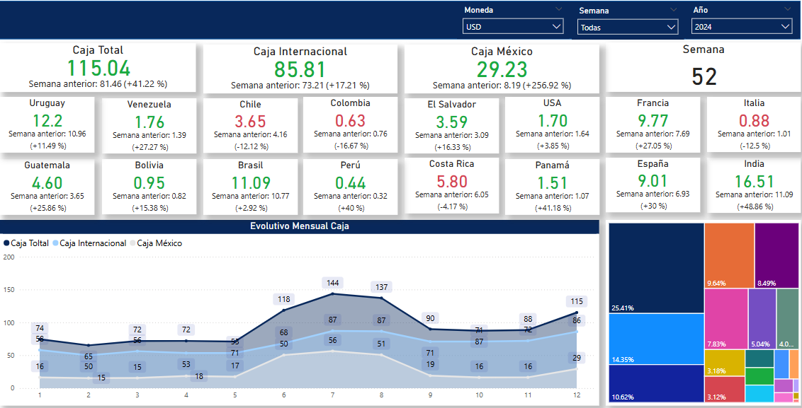
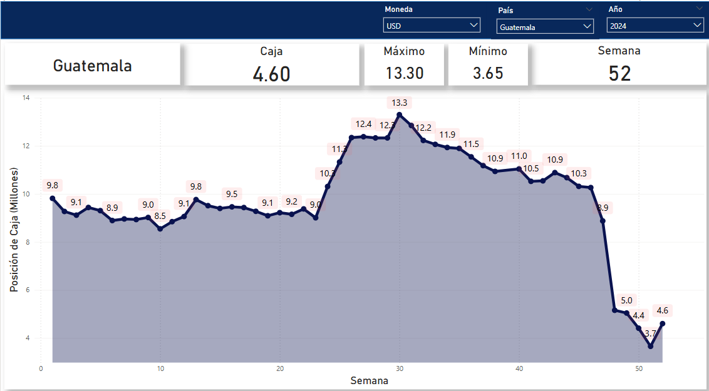
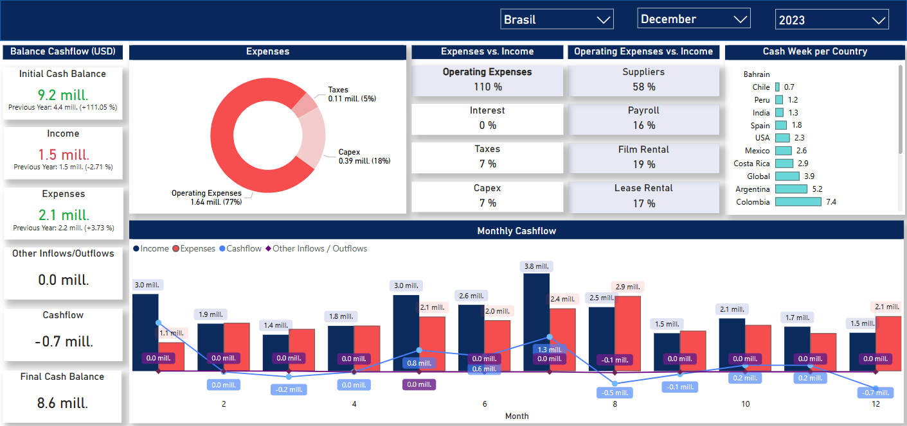
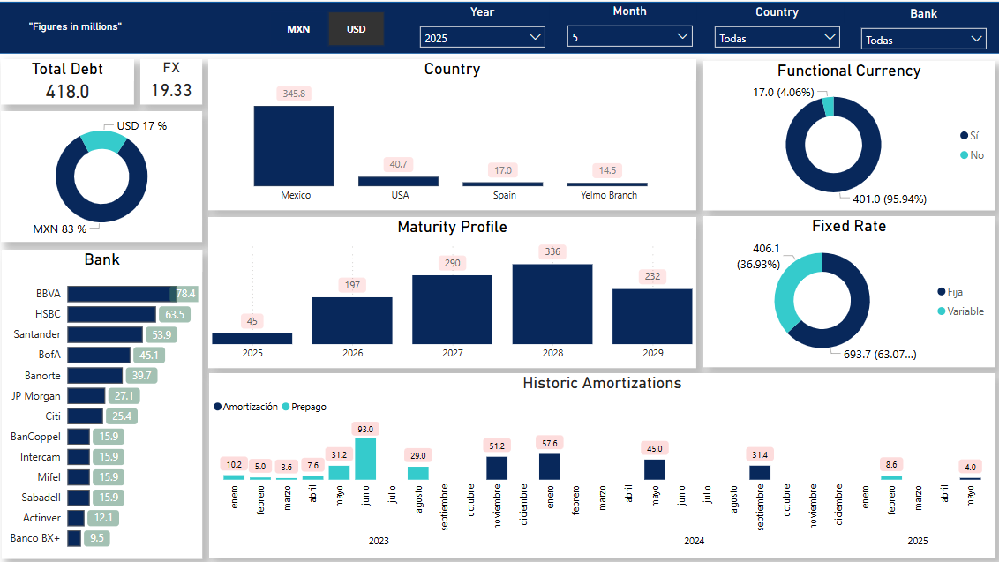

# 💼 Reportes Financieros – Power BI

## 🧩 ¿Cómo comenzó todo?

En el área de Tesorería Internacional de Cinépolis, necesitábamos responder preguntas críticas cada semana:

- ¿Con cuánta caja contamos por país y región?
- ¿Estamos en riesgo de liquidez en el corto plazo?
- ¿Cómo se distribuye la deuda y qué perfil de vencimientos tenemos?
- ¿Cuántas semanas de operación podemos cubrir con la caja disponible?

Estos análisis se hacían en Excel, con archivos extensos, dispersos y poco amigables para su lectura ejecutiva. Fue entonces cuando identifiqué la oportunidad de crear una solución visual, integrada y automatizada en Power BI.

---

## 🚀 Solución desarrollada

Diseñé y desarrollé un sistema de **dashboards financieros en Power BI**, con enfoque ejecutivo, que permite:

- Monitoreo semanal y mensual de caja y flujo de efectivo.
- Seguimiento del perfil de deuda y vencimientos.
- Evaluación de sostenibilidad operativa por país.
- Toma de decisiones estratégicas más rápida y sustentada.

---

## 📊 Descripción de los Dashboards

### 1. **Posición de Caja Semanal**
📍 *Ruta: `/cash-position/images/`*

- Consolidado global con desglose por país, región y marca.
- Evolutivo de caja por semana.
- Comparativos con la semana anterior (+/- %).
- KPIs clave: total, por región y país.

### 2. **Detalle por País**
📍 *Ruta: `/cash-position/images/`*

- Visualización por país de la posición semanal.
- KPIs: caja actual, máximo, mínimo del año.
- Gráfica de tendencia con énfasis en outliers.

### 3. **Cashflow Mensual**
📍 *Ruta: `/cashflow/images/`*

- Balance global: ingresos, egresos, cashflow y saldo final.
- Distribución de gastos operativos (proveedores, renta, impuestos...).
- Relación ingresos vs egresos.
- Indicador: semanas de caja disponible por país.

### 4. **Dashboard de Deuda Consolidada**
📍 *Ruta: `/debt/images/`*

- Total de deuda y desglose por moneda (MXN/USD).
- Distribución por país, banco y tipo de tasa (fija/variable).
- Monto en moneda funcional (reducción de riesgo cambiario).
- Perfil de vencimientos a futuro (2025–2029).
- Amortizaciones históricas y prepagos.

---

## 📈 Impacto del proyecto

✅ Reducción significativa en el tiempo de armado de reportes.  
✅ Visualización centralizada y ejecutiva para 20+ países.  
✅ Mayor autonomía para analistas y líderes financieros.  
✅ Identificación proactiva de riesgos de liquidez y deuda.  
✅ Mejora en la narrativa de la posición financiera frente a Dirección.

---

## 🛠️ Herramientas utilizadas

- Power BI (visualización, modelado DAX)
- Excel / CSV (fuente de datos)
- MT940 (extracción de estados bancarios)
- Automatización de conexiones
- Limpieza de datos con Power Query

---

## 🖼️ Capturas

### 📍 Dashboard General – Caja Consolidada  

### 📍 Dashboard por País  

### 📍 Cashflow Mensual  

### 📍 Deuda Consolidada  

🔐 Por razones de confidencialidad, no se incluyen archivos `.pbix` ni datos reales.

---

## 📁 Estructura del repositorio

📦 financial-dashboard/
├── cashflow/
│   └── images/
│       └── cashflow_dashboard.png
├── cash-position/
│   └── images/
│       ├── cash_position_dashboard.png
│       └── cash_position_2_dashboard.png
├── debt/
│   └── images/
│       └── debt_dashboard.png
├── README.md

---

## 👨‍💼 Sobre mí

Soy Roberto Barragán, profesionista en Finanzas con especialización en Ciencia de Datos. Actualmente en Cinépolis, aplico analítica avanzada para desarrollar dashboards, modelos predictivos y automatizaciones que optimizan procesos clave, mejoran la visibilidad financiera y facilitan la toma de decisiones.

---

## 📌 Nota

Este repositorio es únicamente demostrativo. Los dashboards están basados en datos reales pero visualizados con información alterada por confidencialidad.

